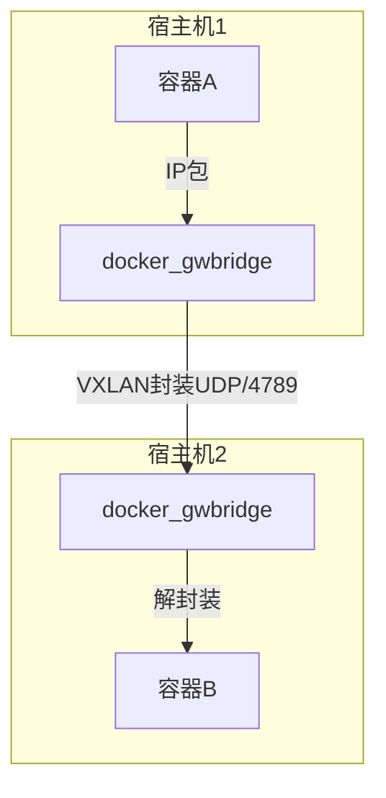

你的这个答案 不对。

在 Docker Swarm 里，docker network create -d overlay --secure 这个命令并不能保证 overlay 网络的流量是加密的。

原因解释如下：

1. Overlay 网络和加密
	•	默认情况下，Docker 的 overlay 网络是通过 VXLAN 封装的，但不加密。
	•	如果你希望 overlay 网络流量在容器间传输时是加密的，需要显式启用 加密（–opt encrypted）。
	•	正确的写法应该是：

docker network create -d overlay --opt encrypted my_overlay

2. --secure 选项
	•	--secure 选项 在 Docker CLI 中不存在，所以写了也不会生效。
	•	有人可能混淆了 --secure 与 --opt encrypted，但实际 Docker 官方文档里只有 --opt encrypted 这个参数。

3. 注意事项
	•	--opt encrypted 会启用 IPsec，在 Swarm 节点之间的 overlay 流量会自动加密。
	•	但这只适用于 Swarm 模式下的 overlay 网络，如果只是单机 Docker overlay（非 Swarm 模式），加密是不会生效的。

⸻

✅ 正确结论
如果你想要 确保 overlay 网络流量加密，命令应该是：

docker network create -d overlay --opt encrypted secure_overlay

❌ 你的写法 --secure 是无效的，不会实现加密。

好的，我帮你系统性解释一下 Docker 的 overlay 网络，这样你就能理解它是怎么工作的，以及为什么在 Swarm 或多节点场景下需要用到它。

⸻

1. Overlay 网络的定义

Overlay 网络是一种 跨主机的虚拟网络，它把不同物理节点上的容器（或服务任务）连接到一个统一的逻辑二层网络中。
底层是通过 VXLAN 封装实现的：容器流量会被封装成 UDP 数据包，在宿主机之间传输。

所以对容器来说，它们像是在同一个二层网络里，即使实际跑在不同的物理机上。

⸻

2. Overlay 网络的工作机制

主要包含几个关键角色：
	•	VXLAN 隧道
在不同 Docker 节点之间创建隧道，容器流量会被封装进 UDP（默认端口 4789）。
	•	分布式 KV 存储
Swarm 模式下，Docker 使用内置的 Raft 分布式数据库来存储网络信息（如 MAC 地址、IP 地址、路由信息）。
这保证了集群中所有节点对网络拓扑的一致性。
	•	服务发现
Docker 内置的 DNS（嵌入在 overlay 网络里），使得你可以通过 服务名访问容器，而不需要硬编码 IP 地址。

⸻

3. Overlay 网络的常见应用场景
	1.	多主机容器通信
在 Swarm 模式下，你可以用 overlay 网络让不同主机上的容器无缝通信。
	2.	服务隔离
不同 overlay 网络之间是隔离的，可以用来实现多租户或多应用的网络隔离。
	3.	加密传输（可选）
如果用 --opt encrypted 创建 overlay 网络，容器间流量会通过 IPsec 加密。

⸻

4. 命令示例

# 创建一个普通的 overlay 网络
docker network create -d overlay my_overlay

# 创建一个带加密的 overlay 网络
docker network create -d overlay --opt encrypted my_secure_overlay

# 查看网络详情
docker network inspect my_overlay

⸻

5. 通信流程示意

下面给你画一个简化的 overlay 网络通信流程图（Mermaid 格式）：

解释：
	1.	容器 A 在 Node1 发出一个 IP 包给容器 B。
	2.	Docker 在 Node1 上将这个 IP 包通过 VXLAN 封装成 UDP 包。
	3.	这个 UDP 包经过物理网络传输到 Node2。
	4.	Node2 解封装，得到原始 IP 包，然后交给容器 B。

⸻

6. 总结
	•	Overlay 网络作用：跨主机虚拟网络，提供类似同一二层的通信能力。
	•	实现方式：VXLAN 封装 + Docker 内置 KV 存储 + 内置 DNS。
	•	加密：需要 --opt encrypted 才能启用 IPsec。
	•	适用场景：Swarm 集群容器互通、多租户隔离、服务发现。

⸻

